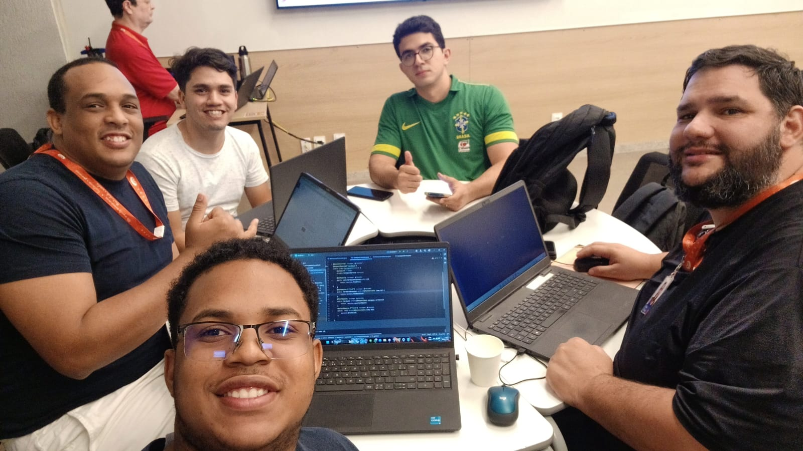

#   
# PEDE FACIL

📌 **Descrição do Projeto**  
Este projeto tem como objetivo desenvolver um sistema de pedidos e gestão de lanchonetes, utilizando Spring Boot no back-end. A solução busca resolver a falta de integração e organização em pequenos estabelecimentos, onde muitas vezes os pedidos são feitos de forma manual e desestruturada, causando erros, atrasos e dificuldade no acompanhamento.

O sistema permitirá que:

Clientes realizem pedidos de forma rápida e intuitiva.

O estabelecimento acompanhe os pedidos em tempo real.

Haja controle de fluxo de pedidos e histórico.

Futuramente seja possível integrar métodos de pagamento online e relatórios de vendas.

Dessa forma, o projeto trará agilidade, organização e redução de erros no atendimento, melhorando a experiência do cliente e otimizando a gestão do negócio.
---

## 📅 Cronograma de Entregas  
| Entrega | Data | Descrição |
|---------|------|-----------|
| Kickoff | 09/09 | Início do projeto |
| Entrega 01 | 30/09 | Histórias definidas + Protótipo Lo-Fi |
| Entrega 02 | 23/10 | Implementação inicial + Screencast |
| Entrega 03 | 17/11 | Arquitetura em camadas + Testes |
| Entrega 04 | 01/12 | Persistência permanente + Documentação final |

---

## 🚀 Entrega 01  
⚠️ **Status:** *Concluido*  

📌 **Requisitos atendidos:**  
- [ ✅] Histórias bem definidas (mínimo 7) com BDD  
- [ ✅] Protótipo Lo-Fi no Figma (mínimo 5 histórias)  
- [ ✅] Screencast de apresentação do protótipo (YouTube)  

📎 **Artefatos:**  
- [Documento de Histórias](https://trello.com/b/0dliEqij/pede-facil)  
- [Protótipo no Figma](https://www.figma.com/design/rM6kJKTfKaIOBLRFdH4Uh1/PROT%C3%93TIPO?node-id=0-1&t=28u6vrtfaZKs9FIJ-1)  
- [Vídeo no YouTube](https://youtu.be/jsAPjRWsdQ8)  

---

## 🚀 Entrega 02  
⚠️ **Status:** *Entrega em produção*  

📌 **Requisitos atendidos:**  
- [ ] Implementação de pelo menos 2 histórias  
- [ ] Commits frequentes no versionamento  
- [ ] Uso de Issue/Bug Tracker  
- [ ] Screencast demonstrando o sistema  

📎 **Artefatos:**  
- [Código Implementado]()  
- [Screencast no YouTube]()  
-   

---

## 🚀 Entrega 03  
⚠️ **Status:** *Entrega em produção*  

📌 **Requisitos atendidos:**  
- [ ] Implementação de mais 2 histórias  
- [ ] Refatoração com arquitetura em camadas  
- [ ] Issue Tracker atualizado  
- [ ] Testes automatizados  
- [ ] Screencast com novas histórias e execução dos testes  

📎 **Artefatos:**  
- [Código Refatorado]()  
- [Testes Automatizados]()  
- [Screencast no YouTube]()  
-   

---

## 🚀 Entrega 04  
⚠️ **Status:** *Entrega em produção*  

📌 **Requisitos atendidos:**  
- [ ] Implementação de pelo menos 3 novas histórias  
- [ ] Persistência de dados (banco de dados/arquivos)  
- [ ] Issue Tracker atualizado  
- [ ] Testes automatizados  
- [ ] Screencast com ênfase nas novas histórias  
- [ ] Documentação clara para execução do projeto  

📎 **Artefatos:**  
- [Guia de Instalação]()  
- [Código Final]()  
- [Screencast no YouTube]()  
-   

---

## ⚙️ Como Executar o Projeto  

### 🔧 Pré-requisitos  
- **Java 17+**  
- **Maven 3.9+** ou **Gradle 8+**  
- **Git**  

### ▶️ Executando com Maven  
```bash
# Clonar o repositório
git clone https://github.com/seu-usuario/seu-projeto.git

# Entrar na pasta
cd seu-projeto

# Compilar e rodar
mvn spring-boot:run 
```
▶️ Executando com Gradle
```
# Clonar o repositório
git clone https://github.com/FIGU3IR4/pedefacil

# Entrar na pasta
cd pedefacil

# Rodar aplicação
./gradlew bootRun
```
O sistema ficará disponível em:
👉 http://localhost:8080

## 👥 Equipe  
# 
- Victor Figueira – Líder Técnico / Desenvolvedor Back-End (Spring Boot)  
- Wesley Figueira – Desenvolvedor Back-End (APIs REST e Integração)  
- Fábio Reis – Desenvolvedor Back-End (Modelagem de Domínio e Regras de Negócio)  
- Everaldo França – Desenvolvedor Back-End (Testes Automatizados e Qualidade)  
- Allan Davila – Desenvolvedor Back-End (Persistência e Banco de Dados)  
- Gabriel Guerra – Desenvolvedor Back-End (Segurança, Autenticação e Autorização)  

